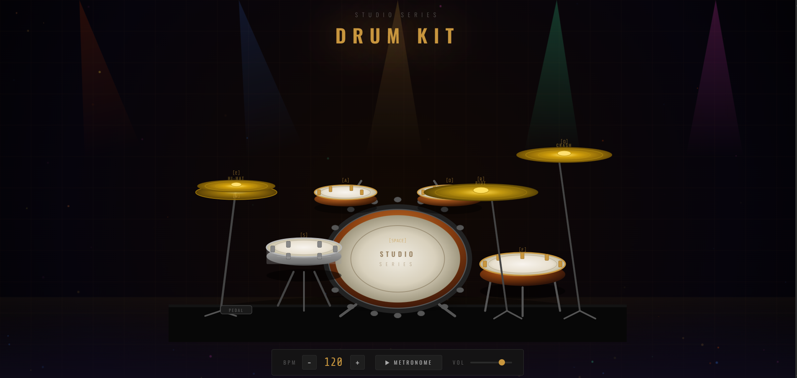

# Virtual Drum Kit

A professional, interactive drum kit simulator with a modern dark theme and stunning visual effects.

## Overview

Virtual Drum Kit is a web-based drum simulator that allows users to play realistic drum sounds with an elegant, stage-lit interface. It features interactive SVG drums, dynamic visualizations, and a professional studio aesthetic.

## Features

- **Interactive Drum Set**: Click or press keys to play different drum sounds
- **Metronome**: Built-in metronome with adjustable BPM (tempo control)
- **Volume Control**: Adjustable master volume with slider
- **Visual Feedback**: 
  - Stage lighting effects with animated light beams
  - Smoke layer animation for atmospheric effect
  - Hit detection labels
  - Shockwave animations on drum strikes
  - Real-time audio visualization canvas
- **Responsive Design**: Adapts to different screen sizes
- **Modern Aesthetic**: Dark theme with gold accents (#c8963e) and premium typography

## Project Structure

```
Virtual Drum Kit/
├── index.html          # Main HTML file with embedded styles and scripts
└── README.md          # This file
```

## screenshot


## Getting Started

### Prerequisites
- Any modern web browser (Chrome, Firefox, Safari, Edge)
- No server setup required - open the HTML file directly

### Installation

1. Download or clone the project
2. Open `index.html` in your web browser

## Usage

### Playing Drums
- **Click** on any drum or cymbal to play it
- **Keyboard shortcuts** (typically mapped to drum pads)

### Controls
- **BPM Slider**: Adjust metronome tempo (beats per minute)
- **Volume Slider**: Control master volume
- **Metronome Toggle**: Start/stop the metronome

### Audio Visualization
- Real-time frequency display shows audio output as a waveform
- Visual indicator of drum hits and metronome clicks

## Technical Details

### Technologies Used
- **HTML5**: Semantic markup
- **CSS3**: Advanced styling with CSS variables, animations, and backdrop-filter effects
- **JavaScript**: Audio Web API, Canvas API, DOM manipulation
- **SVG**: Scalable vector graphics for drum illustrations
- **Web Audio API**: Sound synthesis and audio processing

### Key Features

#### Visual Effects
- **Stage Lights**: Animated light beams with sway motion
- **Smoke Layer**: Drifting background smoke effect
- **Shockwave Animation**: Ripple effect on drum hits
- **Title Pulse**: Glowing text animation

#### Audio Features
- **Metronome**: Adjustable tempo with visual sync
- **Volume Control**: Master volume management
- **Audio Visualization**: Real-time frequency display

## Styling

The project uses CSS variables for easy theme customization:
- `--accent`: #c8963e (Gold)
- `--surface`: #161616 (Dark gray)
- `--border`: #2a2a2a (Border color)
- `--muted`: #555 (Muted text)

## Cross-Browser Compatibility

- Uses standard `appearance` property along with `-webkit-appearance` for consistent input styling
- Supports all modern browsers with CSS3 and Web Audio API support

## Responsive Behavior

- Adapts to mobile, tablet, and desktop screens
- Touch-friendly interface for mobile devices
- Flexible layout with max-width constraints

## Browser Support

- Chrome/Chromium 80+
- Firefox 75+
- Safari 13+
- Edge 80+

## Future Enhancements

Potential improvements for future versions:
- Recording and playback functionality
- Multiple drum kits and sounds
- Custom sound import
- Pattern sequencer
- MIDI controller support
- Sound settings and effects (reverb, delay)

## Notes

- Best experienced in fullscreen mode
- Use headphones or speakers for optimal audio experience
- Smooth animations require modern GPU acceleration

## Testing

Application functionality tested using [TestGrid](https://testgrid.io)
